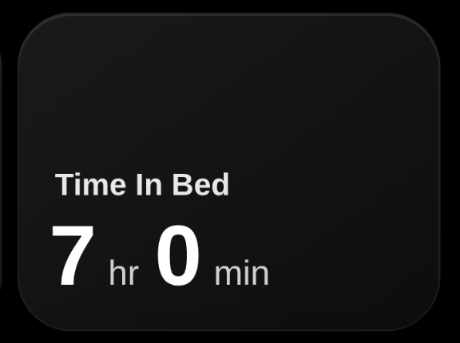
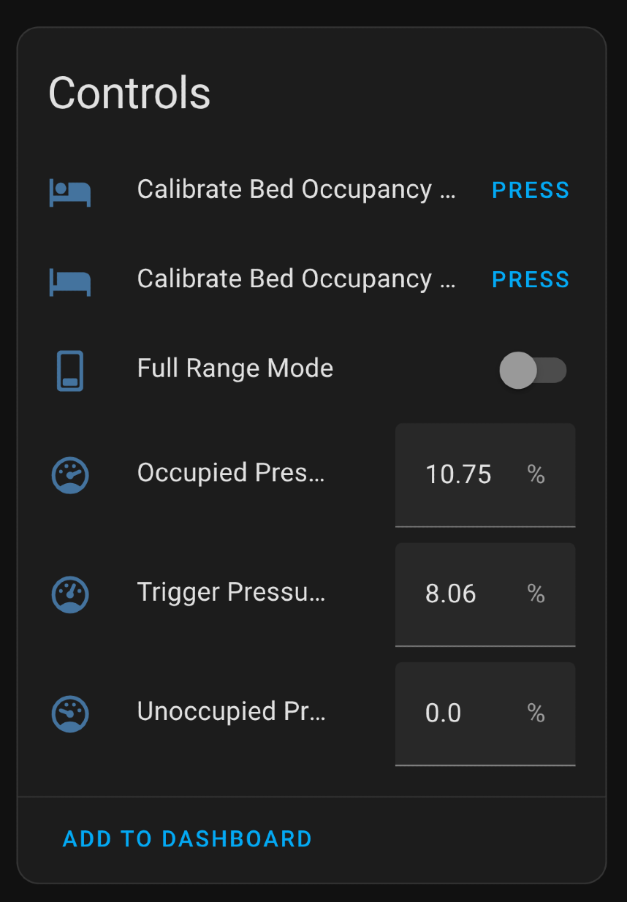

# Bed Occupancy Sensor with ESP8266 + FSR + ESPHome

A low-cost, highly-responsive, and WiFi-enabled bed occupancy sensor using a Force-Sensitive Resistor (FSR) and a NodeMCU ESP8266. It integrates seamlessly with Home Assistant via ESPHome, making it perfect for triggering automations like turning off lights, adjusting thermostats, or managing sleep tracking routines.

This project features dynamic calibration directly from the Home Assistant dashboard, allowing you to fine-tune sensor sensitivity without ever touching the code again.

<p align="center">
  
</p>

-----

## ✨ Features

  * **Dynamic Calibration**: Calibrate the "unoccupied" and "occupied" pressure thresholds directly from Home Assistant using helper buttons.
  * **Adjustable Trigger Point**: The trigger threshold is automatically calculated based on your calibration, but can also be manually overridden.
  * **Dual-Speed Sensors**: Includes both a "fast" and a "standard" binary sensor to prevent false triggers while still allowing for instant automations.
  * **Raw Pressure Reading**: A percentage-based sensor provides a live view of the pressure being applied.
  * **Highly Configurable**: Easily tweak sensor update rates, sensitivity, and delays using the `substitutions` section in the YAML file.
  * **Web Server Fallback**: An access point and web server are created for configuration if Wi-Fi fails.

-----

## 🔧 Hardware

| Component              | Description                                                          |
| ---------------------- | -------------------------------------------------------------------- |
| **NodeMCU ESP8266** | Lolin V3 with CH340 USB interface is a great choice.                 |
| **FSR (e.g., SF15)** | The Force-Sensitive Resistor that detects pressure.                  |
| **Resistor** | A **10kΩ** pull-down resistor.                                       |
| **Micro USB cable** | For flashing the initial firmware and for power.                     |
| **Wires & Breadboard** | For connecting the components.                                       |
| **Optional Plastic Base** | A small, flat piece of plastic or wood to place over the FSR to help distribute weight evenly. |

-----

## ⚡ Circuit Diagram

The circuit is a simple voltage divider. The FSR's resistance changes with pressure, which in turn changes the voltage read by the analog pin (A0) on the ESP8266.

You can assemble it using the following logic:

```plaintext
FSR
 ┌───────────────┐
 │               │
 3.3V ——┬────────┘
        │
       [FSR]
        │
GPIO A0 ─┬────────> ESP8266 A0
         │
        [10kΩ]
         │
        GND
```

1.  Connect one leg of the **FSR** to the **3.3V** pin on the ESP8266.
2.  Connect the other leg of the **FSR** to the **A0** (Analog) pin.
3.  Connect that same **A0** pin to one leg of the **10kΩ resistor**.
4.  Connect the other leg of the **10kΩ resistor** to a **GND** (Ground) pin.

-----

## 📦 ESPHome Configuration

This project is built around a single, powerful ESPHome configuration file. The use of `substitutions` allows for easy customization without needing to dig through the logic.

### `bed.yaml`

```yaml
substitutions:
  name: bed-occupancy-sensor
  friendly_name: Bed Occupancy Sensor
  update_interval: "0.1s"  # Increased sampling rate
  averaging_window_samples: "3"  # Reduced averaging
  trigger_percentile: "0.75"
  fast_delayed_on: "0ms"
  fast_delayed_off: "200ms"  # Reduced delay
  standard_delayed_on: "500ms"  # Reduced delay
  standard_delayed_off: "2s"    # Reduced delay
  reporting_delta: "0.5"    # More sensitive reporting
  reporting_interval_max: "60s"  # More frequent updates
  calibrate_100: "3.3"  # Maximum voltage
  calibrate_0: "0.5"    # Minimum voltage for detection

esphome:
  name: ${name}
  friendly_name: ${friendly_name}
  min_version: 2024.6.0
  name_add_mac_suffix: false

esp8266:
  board: nodemcuv2
  restore_from_flash: true
  early_pin_init: true

logger:
  level: INFO
  baud_rate: 0

api:
ota:
  platform: esphome

web_server:
  port: 80

wifi:
  ssid: !secret wifi_ssid
  password: !secret wifi_password
  manual_ip:
    static_ip: 192.168.0.200
    gateway: 192.168.0.1
    subnet: 255.255.255.0
  fast_connect: true
  power_save_mode: NONE
  output_power: 20dB
  ap:
    ssid: "${friendly_name}"
    password: !secret fallback_password

# Global switch for full range mode
switch:
  - platform: template
    name: "${friendly_name} Full Range Mode"
    id: full_range
    optimistic: true
    restore_mode: RESTORE_DEFAULT_OFF

sensor:
  - platform: adc
    pin: A0
    name: "${friendly_name} Pressure"
    id: bed_sensor
    update_interval: ${update_interval}
    unit_of_measurement: '%'
    icon: mdi:gauge
    filters:
      - multiply: 3.3  # Convert to voltage (0-3.3V)
      - lambda: |-     # Scale voltage to percentage
          float cal_0 = id(full_range).state ? 0 : ${calibrate_0};
          float val = (x - cal_0) * 100;
          float range = ${calibrate_100} - cal_0;
          return val/range;
      - clamp:
          min_value: 0
      - sliding_window_moving_average:
          window_size: ${averaging_window_samples}
          send_every: 1
      - or:
          - delta: ${reporting_delta}
          - throttle: ${reporting_interval_max}

  - platform: copy
    source_id: bed_sensor
    name: "Calibrated ${friendly_name} Pressure"
    id: bed_sensor_calibrated
    icon: mdi:scale-balance
    filters:
      - lambda: |-
          float cal_0 = id(val_unoccupied).state;
          float cal_100 = id(val_occupied).state;
          float val = (x - cal_0) * 100;
          float range = cal_100 - cal_0;
          return val/range;
      - clamp:
          max_value: 100
          min_value: 0

binary_sensor:
  - platform: template
    name: "${friendly_name} (Fast)"
    id: bed_occupied_fast
    device_class: occupancy
    icon: mdi:bed
    filters:
      - delayed_on: ${fast_delayed_on}
      - delayed_off: ${fast_delayed_off}
    lambda: return id(bed_sensor).state > id(val_trigger).state;

  - platform: template
    name: "${friendly_name}"
    id: bed_occupied
    device_class: occupancy
    icon: mdi:bed
    filters:
      - delayed_on: ${standard_delayed_on}
      - delayed_off: ${standard_delayed_off}
    lambda: return id(bed_sensor).state > id(val_trigger).state;

number:
  - platform: template
    name: "${friendly_name} Unoccupied Pressure"
    id: val_unoccupied
    icon: mdi:gauge-empty
    unit_of_measurement: '%'
    optimistic: true
    restore_value: true
    initial_value: 0
    min_value: 0
    max_value: 120
    step: 1.0
    mode: box
    on_value:
      then:
        - script.execute: update_trigger

  - platform: template
    name: "${friendly_name} Occupied Pressure"
    id: val_occupied
    icon: mdi:gauge-full
    unit_of_measurement: '%'
    optimistic: true
    restore_value: true
    initial_value: 100
    min_value: 0
    max_value: 120
    step: 1.0
    mode: box
    on_value:
      then:
        - script.execute: update_trigger

  - platform: template
    name: "${friendly_name} Trigger Pressure"
    id: val_trigger
    icon: mdi:gauge
    unit_of_measurement: '%'
    optimistic: true
    restore_value: true
    initial_value: 50
    min_value: 0
    max_value: 120
    step: 1.0
    mode: box

button:
  - platform: template
    name: "Calibrate ${friendly_name} Unoccupied"
    id: calibration_set_unoccupied
    icon: mdi:bed-empty
    on_press:
      then:
        - number.set:
            id: val_unoccupied
            value: !lambda return round(id(bed_sensor).state * 100)/100.0;

  - platform: template
    name: "Calibrate ${friendly_name} Occupied"
    id: calibration_set_occupied
    icon: mdi:bed
    on_press:
      then:
        - number.set:
            id: val_occupied
            value: !lambda return round(id(bed_sensor).state * 100)/100.0;

script:
  - id: update_trigger
    mode: queued
    then:
      - lambda: |-
          float unoccupied_pressure = id(val_unoccupied).state;
          float occupied_pressure = id(val_occupied).state;
          float trigger_pressure = unoccupied_pressure +
            ((occupied_pressure - unoccupied_pressure) * float(${trigger_percentile}));
          trigger_pressure = round(trigger_pressure * 100)/100.0;
          auto call = id(val_trigger).make_call();
          call.set_value(trigger_pressure);
          call.perform();
```

### `secrets.yaml`

Create a `secrets.yaml` file in the same directory to store your credentials.

```yaml
wifi_ssid: "YourWiFi_SSID"
wifi_password: "YourWiFi_Password"
fallback_password: "YourFallbackPassword"
```

-----

## 🛠️ Setup & Installation

1.  **Clone/Download:** Get the `bed.yaml` and `secrets.yaml` files from this repository.
2.  **Customize:**
      * Fill in your Wi-Fi details in `secrets.yaml`.
      * (Optional) Adjust the `substitutions` in `bed.yaml` if needed. The defaults are a great starting point.
      * (Optional) Set a static IP for the device in the `wifi` section to make it easy to find on your network.
3.  **Connect Device:** Connect your NodeMCU ESP8266 to your computer via a Micro USB cable.
4.  **Flash Firmware:** Use the ESPHome command-line tool to compile and upload the firmware.
    ```bash
    # Install ESPHome if you haven't already: pip install esphome
    # Then run:
    esphome run bed.yaml --device /dev/ttyUSB0
    ```
    *(Note: Your device path may be different, e.g., `COM3` on Windows.)*

-----

## 🏡 Home Assistant Integration

If you have the ESPHome integration set up in Home Assistant, the device will be **auto-discovered** as soon as it connects to your network.

<p align="center">
  
</p>

### Entities

The following entities will be created, allowing for full control and monitoring:

  * `binary_sensor.bed_occupancy_sensor`: The main sensor with a slight delay to prevent false positives. Use this for most of your automations.
  * `binary_sensor.bed_occupancy_sensor_fast`: An instant sensor. Use this for automations that need to fire immediately, like turning on a bedside lamp.
  * `sensor.bed_occupancy_sensor_pressure`: The raw, unfiltered pressure value (0-100%).
  * `sensor.calibrated_bed_occupancy_sensor_pressure`: A calibrated pressure value (0-100%) based on your occupied/unoccupied setpoints.
  * `button.calibrate_bed_occupancy_sensor_unoccupied`: Press this when the bed is empty to set the "zero" point.
  * `button.calibrate_bed_occupancy_sensor_occupied`: Press this when you are in bed to set the "100%" point.
  * `number.bed_occupancy_sensor_trigger_pressure`: The pressure percentage required to trigger the `occupied` state. This is automatically calculated but can be manually set.

### Usage and Calibration Guide

<p align="center">
 
</p>

1.  **Placement:** Place the FSR sensor under your mattress, ideally in a location that experiences consistent pressure, like under your hip or shoulder area. Using a small, flat piece of plastic on top of the FSR can help distribute the weight.
2.  **Calibrate Unoccupied:** With no one in bed, navigate to the device in Home Assistant and press the **Calibrate Unoccupied** button. This sets the baseline pressure.
3.  **Calibrate Occupied:** Lie down in your normal sleeping position. Wait a few seconds for the pressure reading to stabilize, then press the **Calibrate Occupied** button.
4.  **Done\!** The sensor is now calibrated. The trigger threshold will be automatically set to 75% of the range between your two setpoints. You can now use `binary_sensor.bed_occupancy_sensor` in your automations\!

-----

## ✅ License

This project is licensed under the **MIT License**. See the `LICENSE` file for details. Feel free to use, modify, and distribute it for personal and commercial use.
